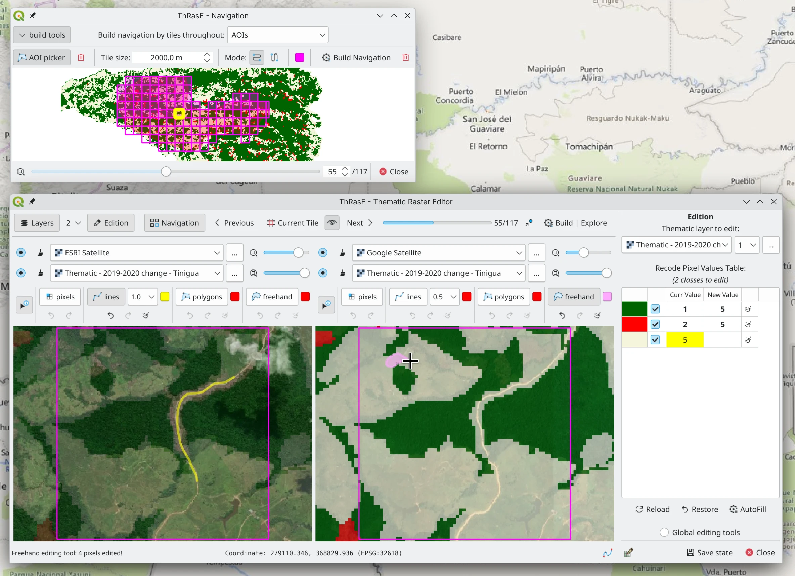

<h1 align="center">ThRasE</h1>

 
<b>Documentation:</b> <a href="https://smbyc.github.io/ThRasE">https://smbyc.github.io/ThRasE</a> 
<!--<b>Paper:</b> <a href="">soon</a>-->

ThRasE is an open-source QGIS plugin for rigorous editing and quality assurance of thematic rasters. It offers synchronized multi-panel views for side-by-side and overlap comparisons with reference data. It utilizes a recode pixel table to modify multiple classes simultaneously in one operation with various editing tool options. An integrated modification tracking system automatically records all changes, providing spatial feedback, transparency, and reproducibility. Systematic tile-based navigation ensures complete spatial coverage during inspection, while session persistence enables seamless multi-day workflows.

ThRasE has been adopted worldwide for diverse applications including manual post-processing to correct land-use/land-cover misclassifications from satellite imagery, knowledge-based correction of classification errors and residual inaccuracies, pixel-level reclassification for land-cover reconstruction across multi-date imagery, annotation of historical aerial imagery for model training and calibration, validation and visual quality assurance workflows, and refinement of agricultural maps. ThRasE is an official component of the Digital Image Processing Protocol for Quantifying Deforestation in Colombia.

> **Note:** ThRasE is specifically designed for editing thematic or categorical raster layers with integer values ([read more](https://smbyc.github.io/ThRasE/thematic_requirements.html)). If you need to edit rasters with float values, consider using the [Serval](https://plugins.qgis.org/plugins/Serval/) plugin instead.

## Install

ThRasE is available from the official QGIS Plugin Repository. To install it:

1. Open QGIS and go to `Plugins` → `Manage and Install Plugins…`.
2. In the search bar, type `ThRasE` and click `Install Plugin`.
3. After installation, activate the plugin from the `Plugins` menu or by opening the ThRasE icon.

## About Us

ThRasE was developed by the Forest and Carbon Monitoring System (SMByC) at the Institute of Hydrology, Meteorology and Environmental Studies (IDEAM) in Colombia. SMByC is responsible for measuring and ensuring the accuracy of official national forest figures.

- [Xavier C. Llano](https://github.com/XavierCLL) - Author and lead developer
- [SMByC-PDI team](https://github.com/SMByC) - Development support and testing

This project was fully funded by the SMByC-IDEAM, Colombia.
