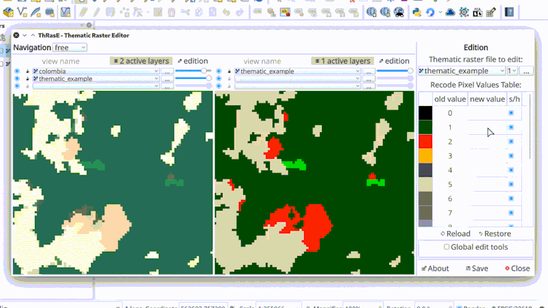

# ThRasE

ThRasE is a powerful and fast thematic raster editor Qgis plugin, it uses a recode pixel table to modify several classes at the same time using pixels, lines, polygons or freehand tools. The plugin has an additional navigation tool to ensure layer inspection.

   > ThRasE is a tool for editing thematic or categorical raster layers, it means raster with integer values ([read more](https://smbyc.github.io/ThRasE/#thematic-raster-to-edit)). If you want to edit raster with float values you can use [serval](https://plugins.qgis.org/plugins/Serval/) plugin for that.

Read more in: [https://smbyc.github.io/ThRasE](https://smbyc.github.io/ThRasE)

## Installation

The plugin can be installed using the QGIS Plugin Manager, go into Qgis to `Plugins` menu and `Manage and install plugins`, in `All` section search for `ThRasE`.

The plugin will be available in the `Plugins` menu and `Plugins toolbar`.

## Source code

The official version control system repository of the plugin:
[https://github.com/SMByC/ThRasE](https://github.com/SMByC/ThRasE)

The home plugin in plugins.qgis.org: [https://plugins.qgis.org/plugins/ThRasE/](https://plugins.qgis.org/plugins/ThRasE/)

## Issue Tracker

Issues, ideas and enhancements: [https://github.com/SMByC/ThRasE/issues](https://github.com/SMByC/ThRasE/issues)

## About us

ThRasE was developing, designed and implemented by the Group of Forest and Carbon Monitoring System (SMByC), operated by the Institute of Hydrology, Meteorology and Environmental Studies (IDEAM) - Colombia.

Author and developer: *Xavier Corredor Ll.*  
Theoretical support, tester and product verification: SMByC-PDI group

### Contact

Xavier Corredor Ll.: *xcorredorl (a) ideam.gov.co*  
SMByC: *smbyc (a) ideam.gov.co*

## License

ThRasE is a free/libre software and is licensed under the GNU General Public License.
