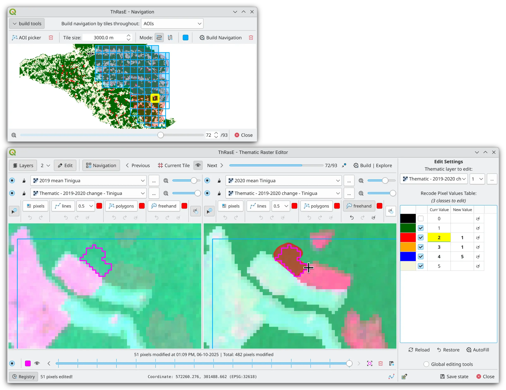

# ThRasE - Thematic Raster Editor

ThRasE is a powerful and flexible QGIS Python plugin for fast thematic raster editing. It utilizes a recode pixel table
to modify multiple classes simultaneously using various tools, including pixels, lines, polygons, and freehand drawing.
It includes a registry system that tracks all modifications made during editing sessions. The plugin also features a
navigation tool to facilitate systematic layer inspection.

The main purpose of the plugin is to ensure the quality of thematic maps throughout editing and reclassification
processes by providing modification tracking registry, systematic visual inspection tools, and comparison capabilities
with reference data. However, multiple users and projects have used the plugin for various purposes, such as:
Recreating thematic maps from scratch, labeling images for tasks such as semantic segmentation, creating training data
for machine learning models, refining agricultural maps, updating urban planning maps, classifying and fixing land
cover types.

Read more in: [https://smbyc.github.io/ThRasE](https://smbyc.github.io/ThRasE)

> **Note:** ThRasE is specifically designed for editing thematic or categorical raster layers with integer
> values ([read more](https://smbyc.github.io/ThRasE/#thematic-raster-requirements)). If you need to edit rasters with float
> values, consider using the [Serval](https://plugins.qgis.org/plugins/Serval/) plugin instead.

## Source Code

Source code, issue tracker, QA and ideas: [https://github.com/SMByC/ThRasE](https://github.com/SMByC/ThRasE)

The plugin homepage on plugins.qgis.org: [https://plugins.qgis.org/plugins/ThRasE/](https://plugins.qgis.org/plugins/ThRasE/)

## About Us

ThRasE was developed, designed, and implemented by the Group of Forest and Carbon Monitoring System (SMByC), operated by
the Institute of Hydrology, Meteorology and Environmental Studies (IDEAM) - Colombia.

Author and developer: *Xavier C. Llano* *<xavier.corredor.llano@gmail.com>*
Theoretical support, testing, and product verification: SMByC-PDI group

## License

ThRasE is free/libre software and is licensed under the GNU General Public License.
