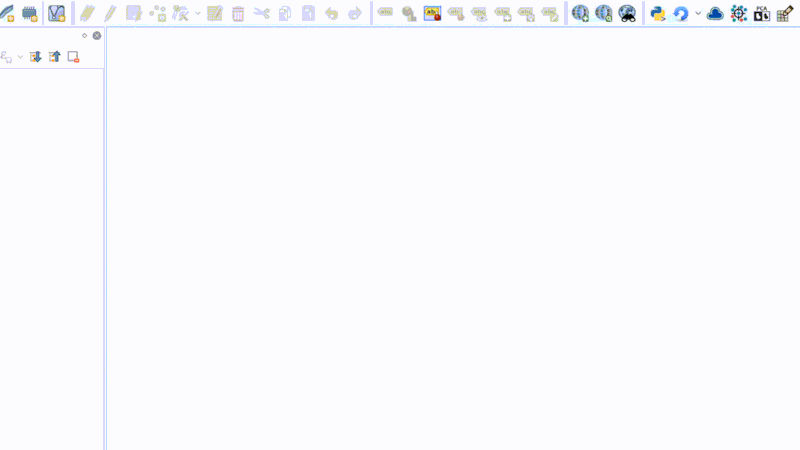
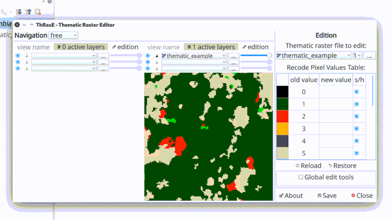
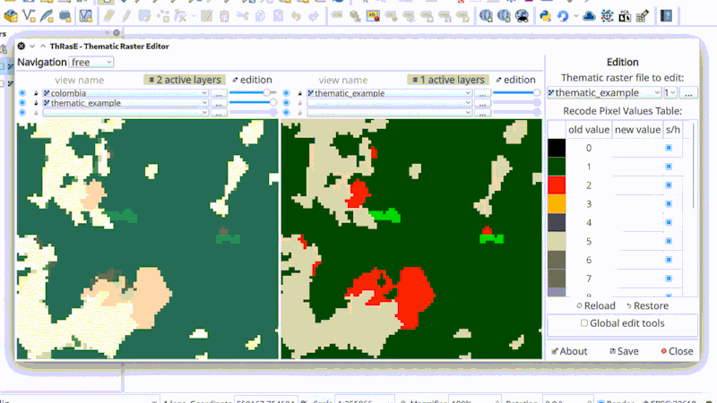
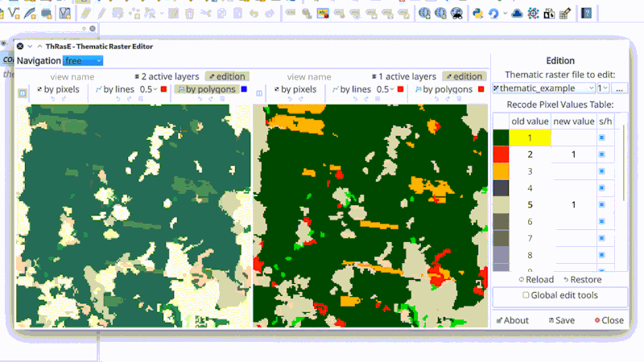
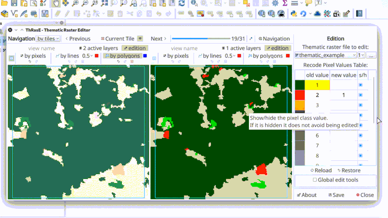

# ThRasE

ThRasE is a Thematic Raster Editor plugin of Qgis, it uses a recode pixel table to modify several classes at the same time using pixels, lines or polygons tools. The plugin has a navigation tool to guarantee the revision of the thematic raster.

1. [Thematic raster to edit](#thematic-raster-to-edit)
2. [View config and active layers](#view-config-and-active-layers)
3. [Editing](#editing)
4. [Navigation](#navigation)
5. [Save configuration and restore it](#save-configuration-and-restore-it)

## Thematic raster to edit

Thematic raster file to edit must be a categorical thematic layer **with byte or integer as data type** with a specific pixel-value/color associated. There are two types, respect to pixel-value/color associated, accepted in ThRasE:

1. **Thematic with paletted or singleband pseudocolor on the fly**:

    You can use any raster (of byte or integer as data type) with specific style loaded (from Qgis project or qml file style) or done on the fly in Qgis. Go to `properties` of the raster, then go to `style`, select `Paletted/Unique values` or `Singleband pseudocolor` and generate the desired pixel-value/color associated (manually or generated automatically using the several options that Qgis have to do this) with only one requirement: **the pixel-values associated must be integers**.

    > *Optional:* After configure the style in Qgis for the raster is recommended save it in `.qml` Qgis style file, else Qgis save it in temporal file (or on the fly) and if you restart the Qgis and load the raster again you lost the pixel-value/color style associated. For save the style go to `Style` menu and click in `Save as default` Qgis save it in the same place and name of the raster with extension `.qml`.

    > *Optional:* Alternative (or additional) to the above, you can save all layers style saving it in a Qgis project.

2. **Thematic with color table**:

    You can use any raster (of byte or integer as data type) with pixel-values/color associated through a color table inside it as metadata. You can see it using `gdalinfo` or in `style` in layer `properties` this is shown as `paletted`.

If you want test the plugin with a example of a valid thematic raster, download [thematic_example.tif](https://raw.githubusercontent.com/SMByC/ThRasE/master/docs/thematic_example.tif)

## View config and active layers

The configuration of the view grid is done only when the plugin is opened in the `new` tab, in it, you can set the columns and rows.

Each view has the option of three layers, you can use one, two or three active layers to view and overlap in the respective order. You can set the opacity of each layer if you need it.

## Editing

Each view has an editing tool, there are three options to edit; pixels, lines or polygons. Each tool has a maximum of 20 actions to do undo or redo. You can use any view for edit, but always the image to edit is the thematic selected even if it is not showing in the view.

## Navigation

The navigation is an optional tool, with the purpose to guarantee the revision of the thematic raster, going tile by tile throughout the thematic file, areas of interest, polygons, points or centroid of polygons.

## Save configuration and restore it

With this `Save` button you can save all settings and configuration of ThRasE dialog, views, pixel table with colors and values, navigation, current tile, size dialog, current extent, among others.

> `Optional:` If you are using network layers in the view (such as Google, Bing, Esri satellite) use save/load a Qgis project, `important:` load first the Qgis project before load the .yml saved with ThRasE

## About us

ThRasE was developing, designed and implemented by the Group of Forest and Carbon Monitoring System (SMByC), operated by the Institute of Hydrology, Meteorology and Environmental Studies (IDEAM) - Colombia.

Author and developer: *Xavier Corredor Ll.*  
Theoretical support, tester and product verification: SMByC-PDI group

### Contact

Xavier Corredor Ll.: *xcorredorl (a) ideam.gov.co*  
SMByC: *smbyc (a) ideam.gov.co*

## License

ThRasE is a free/libre software and is licensed under the GNU General Public License.
