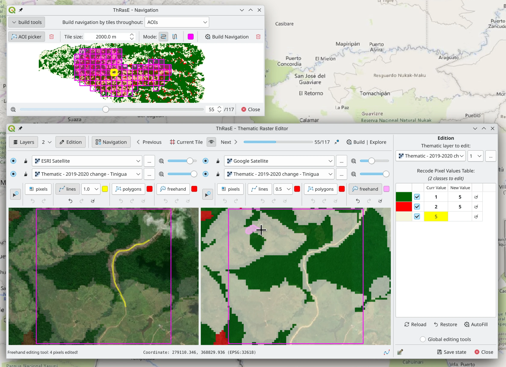
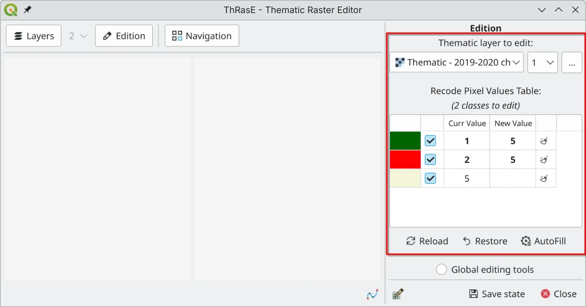
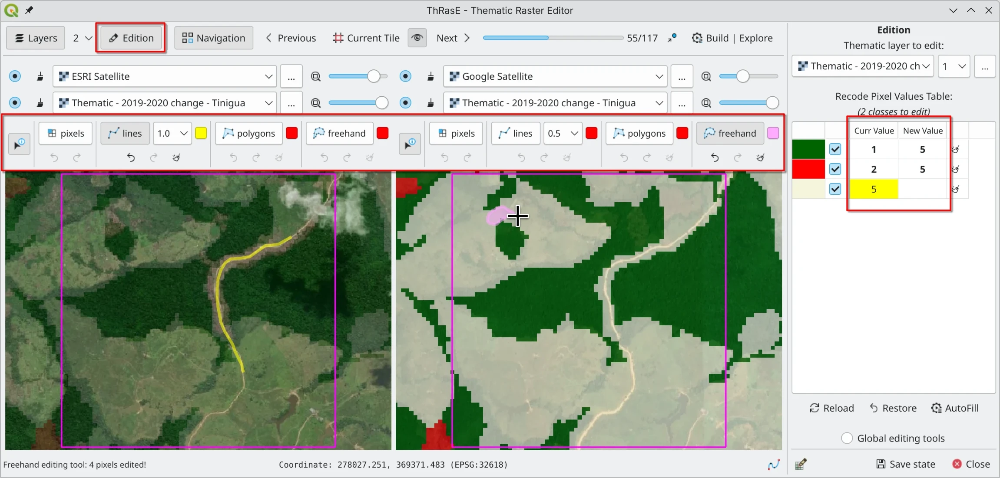
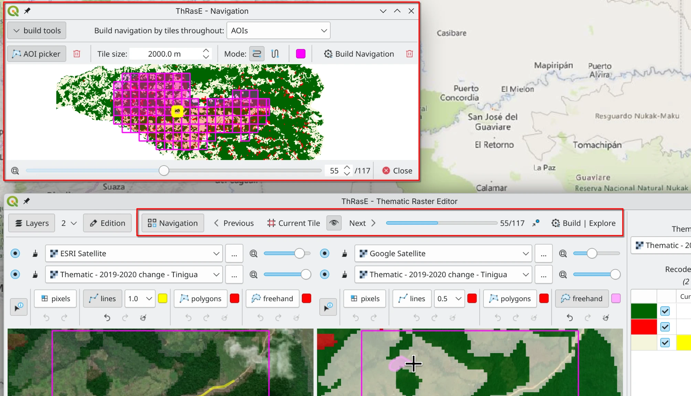

# ThRasE - Thematic Raster Editor

ThRasE is a powerful and flexible QGIS Python plugin for fast thematic raster editing. It utilizes a recode pixel table to modify multiple 
classes simultaneously using various tools, including pixels, lines, polygons, and freehand drawing. The plugin also 
features a navigation tool to facilitate systematic layer inspection.

## Thematic Raster Requirements

The thematic raster file to be edited must satisfy the following criteria:

- It must be a **categorical thematic layer** with byte or integer data type.
- It must have a specific pixel-value/color association. If not, ThRasE will prompt you to apply a temporary and random 
  pixel-value/color association.

ThRasE accepts two types of formats, depending on the pixel-value/color association:

1. **Thematic with paletted or singleband pseudocolor on the fly**:

   You can use any raster (with byte or integer data type) with a specific style loaded (from a QGIS project or QML file)
   or applied symbology style on the fly in QGIS.

   Supported symbology (render types):

   - **Paletted/Unique values** (recommended!)
   - **Singleband pseudocolor** (using `Exact Interpolation`, with `Equal interval` mode, and the number of classes must 
     match the layer classes)
    
   > **Important**: The pixel values must be integers.

   > **Tip:** After configuring the style in QGIS, it's recommended to save it as a `.qml` style file. Otherwise, QGIS 
   > saves it as a temporary file, and you'll lose the pixel-value/color association if you restart QGIS and reload the 
   > raster. To save the style, go to the `Style` menu and click `Save as Default`. QGIS will save it in the same 
   > location as the raster with a `.qml` extension.

   > **Alternative:** You can also save all layer styles by saving them in a QGIS project.

2. **Thematic with embedded color table**:

   You can use any raster (with byte or integer data type) that has pixel-value/color associations through a color table
   embedded in its metadata. You can view this using `gdalinfo` or in the `Symbology` tab in layer `Properties`, where 
   it will be shown as `Paletted`.

You can download an example of a valid thematic raster [here](https://raw.githubusercontent.com/SMByC/ThRasE/master/docs/thematic_example.tif).

## View Configuration and Active Layers

- The grid configuration can only be set when the plugin is first opened under the `New` tab.
- Each view provides options for up to three layers.
- Each layer's opacity can be adjusted according to your requirements.

## Editing Tools

- Each view has an editing toolset with four options: pixels, lines, polygons, and freehand drawing.
- There are no limits on undo or redo actions.
- You can use any view for editing, but the changes will always apply to the selected thematic raster, even if it's not 
  visible in the current view.

> **Warning:** After each editing operation, the layer is saved (overwritten) on disk. If you want to preserve the original 
> layer, make a backup copy before starting the editing process.

## Navigation Tools

- The navigation tool helps you systematically review the thematic raster by moving through generated tiles, ensuring 
  complete coverage during the revision process.
- You can generate review tiles based on: areas of interest (drawn over the thematic file), polygons, points, or 
  centroids of polygons.

## Save and Restore Configuration

- The `Save State` and `Load` buttons allow you to save or restore all settings and configurations, including:
  - ThRasE dialog settings
  - View configurations
  - Pixel table with colors and values
  - Navigation settings and status
  - Current tile position
  - Dialog size
  - Current extent and position
  - And more

> **Important:** If you are using web or network layers (such as images from Google, Esri, Google Earth Engine, or XYZ), 
> first save and load your QGIS project, and then load the ThRasE configuration file (`.yaml`).

## About Us

ThRasE was developed, designed, and implemented by the Group of Forest and Carbon Monitoring System (SMByC), operated by
the Institute of Hydrology, Meteorology and Environmental Studies (IDEAM) - Colombia.

Author and developer: *Xavier C. Llano* *<xavier.corredor.llano@gmail.com>*  
Theoretical support, testing, and product verification: SMByC-PDI group

## License

ThRasE is free/libre software and is licensed under the GNU General Public License.
