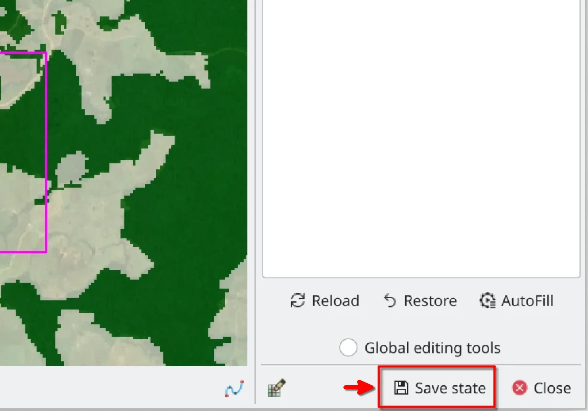

# ThRasE

ThRasE is a powerful and fast Thematic Raster Editor QGIS plugin. It utilizes a recode pixel table to modify multiple 
classes simultaneously using various tools, including pixels, lines, polygons, and freehand drawing. The plugin also 
features a navigation tool to facilitate layer inspection.

## Thematic raster to edit

The thematic raster file to be edited must satisfy the following criteria. 

- It must be a **categorical thematic layer** with byte or integer as data type.
- It must have a specific pixel-value/color association. Else, ThRasE will ask you to apply a temporal and random 
  pixel-value/color association.

There are two types of formats accepted in ThRasE, depending on the pixel-value/color association:

1. **Thematic with paletted or singleband pseudocolor on the fly**:

   You can use any raster (of byte or integer as data type) with specific style loaded (from Qgis project or qml file
   style) or done on the fly in Qgis. Go to `properties` of the raster, then go to `style`,
   select `Paletted/Unique values` or `Singleband pseudocolor` (using `Exact` `Interpolation`) and generate the desired
   pixel-value/color associated (manually or generated automatically using the several options that Qgis have to do
   this) with only one requirement: **the pixel-values associated must be integers**.

   > *Optional:* After configure the style in Qgis for the raster is recommended save it in `.qml` Qgis style file, else
   Qgis save it in temporal file (or on the fly) and if you restart the Qgis and load the raster again you lost the
   pixel-value/color style associated. For save the style go to `Style` menu and click in `Save as default` Qgis save it
   in the same place and name of the raster with extension `.qml`.

   > *Optional:* Alternative (or additional) to the above, you can save all layers style saving it in a Qgis project.

2. **Thematic with color table**:

   You can use any raster (of byte or integer as data type) with pixel-values/color associated through a color table
   inside it as metadata. You can see it using `gdalinfo` or in `style` in layer `properties` this is shown
   as `paletted`.

You can test an example of a valid thematic raster [here](https://raw.githubusercontent.
com/SMByC/ThRasE/master/docs/thematic_example.tif)

## View config and active layers

- The grid configuration can be done only when the plugin is opened under the `new` tab.
- Each view provides an option for three layers.
- Each layer's opacity can be adjusted as per the requirement.

## Editing

- Each view has an editing tool, with four options; pixels, lines, polygons, and freehand.
- Users get a maximum of 20 actions for undo or redo.
- You can use any view for edit, but always the image to edit is the thematic selected even if it is not showing in 
  the view.

> `WARNING:` After each editing operation, the layer is saved (overwritten) on disk. If you want to keep the original 
> layer you must make a copy of it before editing.

## Navigation

- The navigation tool assists in the review of the thematic raster going tile by tile generated, with the purpose to 
  guarantee the revision of the thematic file.
- You can generate review tiles throughout; areas of interest (drawn over the thematic file), polygons, points or 
  centroid of polygons.

## Save configuration and restore it

- With this `Save state` and `Load` button you can save or restore all settings and configuration of; ThRasE dialog, 
  views, pixel table with colors and values, navigation settings and status, current tile, size dialog, current 
  extent and position, among others.

> `Optional:` If you are using network layers in the view (such as Google, Bing, Esri satellite) use save/load a Qgis
> project, `important:` load first the Qgis project before load the .yml saved with ThRasE

## About us

ThRasE was developing, designed and implemented by the Group of Forest and Carbon Monitoring System (SMByC), operated by
the Institute of Hydrology, Meteorology and Environmental Studies (IDEAM) - Colombia.

Author and developer: *Xavier C. Llano* *<xavier.corredor.llano@gmail.com>*  
Theoretical support, tester and product verification: SMByC-PDI group

## License

ThRasE is a free/libre software and is licensed under the GNU General Public License.
