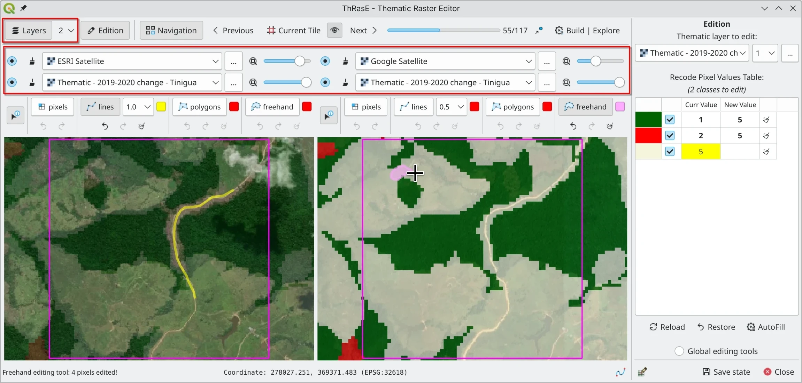

# ThRasE - Thematic Raster Editor

ThRasE is a powerful and flexible QGIS Python plugin for fast thematic raster editing. It utilizes a recode pixel table 
to modify multiple classes simultaneously using various tools, including pixels, lines, polygons, and freehand drawing. 
The plugin also features comprehensive navigation tools that enable systematic and thorough layer inspection, a 
critical aspect of maintaining data quality and accuracy in thematic mapping projects.

The main purpose of the plugin, but not limited to this, is to ensure the quality of thematic maps throughout editing 
and reclassification processes by enabling systematic visual inspection and comparison with reference data.

## Thematic Raster Requirements

The thematic raster file to be edited must satisfy the following criteria:

- It must be a **categorical thematic layer** with byte or integer data type.
- It must have a specific pixel-value/color association. If not, ThRasE will prompt you to apply a temporary and random 
  pixel-value/color association.

ThRasE accepts two types of formats, depending on the pixel-value/color association:

1. **Thematic with paletted or singleband pseudocolor on the fly**:

   You can use any raster (with byte or integer data type) with a specific style loaded (from a QGIS project or QML file)
   or applied symbology style on the fly in QGIS.

   Supported symbology (render types):

   - **Paletted/Unique values** (recommended!)
   - **Singleband pseudocolor** (using `Exact Interpolation`, with `Equal interval` mode, and the number of classes must 
     match the layer classes)

   > **Important**: The pixel values must be integers.

   > **Tip:** After configuring the style in QGIS, it's recommended to save it as a `.qml` style file. Otherwise, QGIS 
   > saves it as a temporary file, and you'll lose the pixel-value/color association if you restart QGIS and reload the 
   > raster. To save the style, go to the `Style` menu and click `Save as Default`. QGIS will save it in the same 
   > location as the raster with a `.qml` extension.

   > **Alternative:** You can also save all layer styles by saving them in a QGIS project.

2. **Thematic with embedded color table**:

   You can use any raster (with byte or integer data type) that has pixel-value/color associations through a color table
   embedded in its metadata. You can view this using `gdalinfo` or in the `Symbology` tab in layer `Properties`, where 
   it will be shown as `Paletted`.

You can download an example of a valid thematic raster [here](https://raw.githubusercontent.com/SMByC/ThRasE/master/docs/thematic_example.tif).

## View Configuration and Active Layers

- The grid configuration can only be set when the plugin is first opened under the `New` tab.
- Each view provides options for up to three layers, allowing you to compare the thematic layer with reference data.
- Each layer's opacity can be adjusted according to your requirements.
- Multiple views with different layer combinations facilitate comprehensive inspection and comparison, enhancing your 
ability to identify areas that need editing.

## Editing Tools

- Each view has an editing toolset with four options: pixels, lines, polygons, and freehand drawing.
- There are no limits on undo or redo actions.
- You can use any view for editing, but the changes will always apply to the selected thematic raster, even if it's not 
  visible in the current view.
- The editing tools are designed to work seamlessly with the navigation system, allowing you to make corrections as you 
  systematically inspect the thematic raster.
- The ability to modify multiple classes simultaneously using the recode pixel table makes the editing process efficient, 
  especially when working through large datasets tile by tile.

> **Warning:** After each editing operation, the layer is saved (overwritten) on disk. If you want to preserve the original 
> layer, make a backup copy before starting the editing process.

## Navigation Tools

### Importance of Systematic Layer Inspection

Thorough and systematic inspection of thematic rasters is crucial for ensuring data quality and accuracy. The navigation 
tools in ThRasE are designed to facilitate this process by:

- **Ensuring Complete Coverage**: By dividing the raster into manageable tiles, you can methodically review every part 
  of the layer without missing any areas.
- **Tracking Progress**: The navigation system keeps track of which tiles have been reviewed, helping you maintain a 
  consistent workflow and resume work from where you left off.
- **Focusing Attention**: Each tile presents a smaller area to analyze, allowing for more detailed inspection and 
  reducing the risk of oversight.
- **Optimizing Workflow**: The ability to navigate in horizontal or vertical patterns helps optimize the review process 
  based on the specific characteristics of your data.

### Features and Capabilities

- The navigation tool helps you systematically review the thematic raster by moving through generated tiles, ensuring 
  complete coverage. You can generate review tiles based on:
  - The entire thematic file
  - Areas of interest (drawn directly over the thematic file)
  - Polygons from vector files
  - Points from vector files
  - Centroids of polygons from vector files
- Navigation modes include horizontal (left-right and top-bottom) and vertical (top-bottom and left-right) patterns.
- The current tile can be kept visible during editing for better context awareness.
- Integration with external tools like Google Earth Engine allows for additional analysis and verification.

## Global Editing Tools

ThRasE provides two powerful global editing options that allow you to apply changes to multiple areas simultaneously:

- **Apply to the Whole Image**: This option applies the changes defined in the pixel recoding table to the entire 
  thematic raster. This operation cannot be undone, so use with caution

- **Apply from Thematic File Classes**: This option allows you to selectively apply changes to specific classes from 
  another thematic file. Particularly useful for targeted updates based on another classification:
  - Select another thematic raster file with the same coordinate system and pixel size
  - Choose which classes from the selected file you want to modify
  - Changes defined in the pixel recoding table will only be applied to pixels that match the selected classes 
    (highlighted in yellow)

## CCD Plugin Integration

ThRasE integrates with the Continuous Change Detection (CCD) plugin to enhance your thematic raster editing workflow. 
The CCD plugin helps analyze trends and breakpoints of change over multi-year time series at specific locations through 
Google Earth Engine, while editing your thematic raster.

- The CCD plugin provides:
  - Ability to analyze temporal patterns at specific points of interest
  - Support for both Landsat and Sentinel data sources
  - Visualization of spectral trends and detected breakpoints
  - Identification of gradual and abrupt changes over time

> **Note:** To use this feature, you must have the CCD Plugin installed in QGIS.

## Save and Restore Configuration

 

- The `Save State` and `Load` buttons allow you to save or restore all settings and configurations, including:
  - ThRasE dialog settings
  - View configurations
  - Pixel table with colors and values
  - Navigation settings and status
  - Current tile position
  - Dialog size
  - Current extent and position
  - CCD plugin settings
  - And more

- This feature is particularly valuable for:
  - Maintaining inspection progress across multiple work sessions
  - Ensuring consistent review methodology for large projects
  - Collaborating with team members by sharing standardized inspection configurations
  - Resuming work exactly where you left off, without losing track of which areas have been reviewed

> **Important:** If you are using web or network layers (such as images from Google, Esri, Google Earth Engine, or XYZ), 
> first save and load your QGIS project, and then load the ThRasE configuration file (`.yaml`).

## About Us

ThRasE was developed, designed, and implemented by the Group of Forest and Carbon Monitoring System (SMByC), operated by
the Institute of Hydrology, Meteorology and Environmental Studies (IDEAM) - Colombia.

Author and developer: *Xavier C. Llano* *<xavier.corredor.llano@gmail.com>*  
Theoretical support, testing, and product verification: SMByC-PDI group

## License

ThRasE is free/libre software and is licensed under the GNU General Public License.
