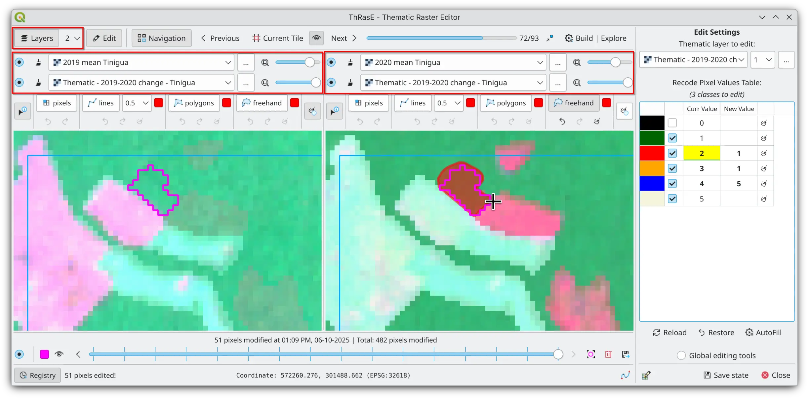
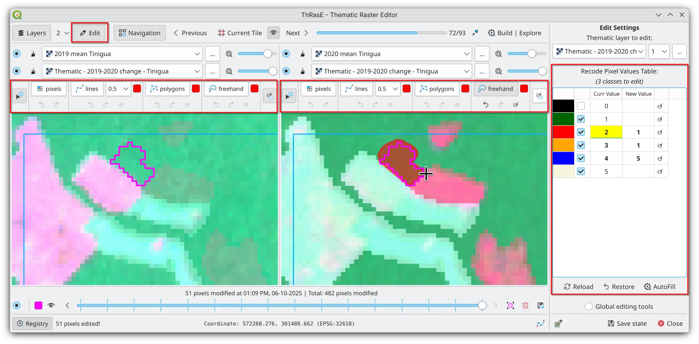
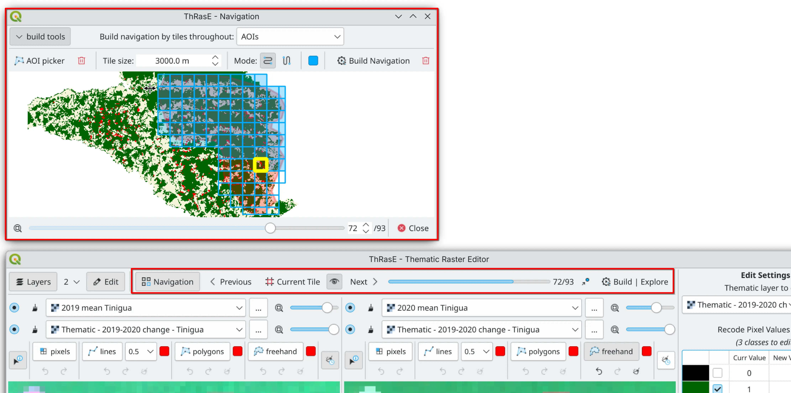

# Summary

Thematic maps are critical tools that translate complex spatial data into actionable insights, but their reliability depends on rigorous quality assurance because mapping workflows inevitably introduce errors and uncertainty. To address this need, we developed ThRasE, an open-source QGIS plugin that provides comprehensive editing tools, modification tracking, systematic visual inspection features, and capabilities for comparison with reference data for manual post-classification correction of thematic maps.

# Statement of need

Thematic maps serve as indispensable analytical tools that simplify complex, continuous spatial data into visually accessible representations, enabling informed decision-making across a wide range of disciplines. In environmental management, land-use/land-cover maps underpin risk assessment, resource stewardship, and scenario planning [@vallet:2024]. In cities, thematic mapping enables infrastructure and land-use analysis, green-space equity assessments, and data-driven urban analytics [@biljecki:2021]. In agriculture, map-based precision farming uses yield, vegetation, and moisture layers to guide variable-rate inputs and crop monitoring [@sishodia:2020]. In public health, they highlight disease or exposure hotspots for precise responses, enabling hotspot detection in epidemiology [@bhatt:2012]. Overall, thematic maps function as instruments for representation, communication, and decision support, providing a symbolic representation of reality that bridges complex data with practical insights.

Ensuring the quality of thematic maps enhances the reliability of spatial data, which is critical for supporting informed decision-making [@foody:2001]. Because maps are models of reality, they inevitably contain errors introduced by projection, compilation, and symbolization [@lightfoot:1987; @maling:2013]. Many issues originate in the production process itself. For example, satellite-based classifications (e.g., supervised or unsupervised workflows) can introduce errors of omission or commission, scale mismatches, or temporal misalignments with ground conditions [@Schowengerdt:2007]. These limitations do not undermine the value of thematic maps; rather, they highlight the importance of rigorous quality assurance. Best practices include conducting formal accuracy assessments [@congalton:2019], transparently reporting error and uncertainty [@maceachren:1992], and, where appropriate, applying targeted post-classification corrections to address misclassifications [@manandhar:2009].

The value of a thematic map ultimately depends on its quality, which is primarily driven by the original data sources and classification methodologies. However, post-classification correction serves as a widely adopted final step to refine misclassifications and improve outcomes [@hutchinson:1982]. A common approach, particularly for remote sensing-based maps, involves integrating ancillary data and knowledge-based rules to resolve misclassifications, reduce commission errors, and enhance overall accuracy [@manandhar:2009; @thakkar:2017]. These corrections often rely on manual editing or semi-automated techniques guided by expert knowledge and reference data. This is precisely the context in which ThRasE was developed.

In Colombia, the Forest and Carbon Monitoring System (SMByC) of the Institute of Hydrology, Meteorology and Environmental Studies (IDEAM) is responsible for measuring and ensuring the accuracy of the official national forest figures. As part of the SMByC, we identified the need not only for review and editing capabilities but also for a dedicated tool to enable systematic and rigorous quality control of final products, thereby guaranteeing reliable results [@galindo:2014]. To address this gap, we developed ThRasE, an open-source QGIS plugin that provides flexible editing, visual inspection, and auditable quality assurance workflows.

ThRasE offers a suite of editing tools, a modification tracking registry, systematic visual inspection features, and comparison capabilities with reference data. By incorporating ancillary data and knowledge-based rules, ThRasE enables expert-guided manual editing, facilitating targeted corrections of misclassifications and fine-tuning of class assignments. ThRasE has been used for multiple purposes worldwide, including manual post-processing to correct land-use/land-cover misclassifications via photo-interpretation of satellite image mosaics [@vallet:2024; @rayner:2022]; knowledge-based manual correction of misclassifications and residual errors [@rayner:2021effects; @senterre:2023; @bladh:2024]; manual classification/reclassification of pixels for land-cover reconstruction to reconcile multi-date imagery [@gunawan:2023]; annotation of historical aerial imagery for model calibration and fine-tuning [@eyster:2024]; as a validation/visual QA step [@hariyanto:2024]; refinement of agricultural maps [@gandharum:2025; @rayner:2021historical]; among other applications [@hariyanto:2022; @dupuy:2024; @queiroga:2020; @nunes:2024]. Furthermore, ThRasE is an official component of our Digital Image Processing Protocol for Quantifying Deforestation in Colombia [@galindo:2014].

# Key features

## Multi-View Configuration

ThRasE is designed to prioritize visual comparison. To that end, analysts can arrange multiple synchronized panels in a grid, with each panel blending up to three layers (for example, the target thematic raster, a reference product, and ancillary context) with independent opacity controls. Creating several panels with different layer combinations and opacity settings enables overlap inspection and side-by-side comparison, making it easier to spot boundary errors, edge artifacts, and local inconsistencies that are often missed when toggling a single map. This layout shortens the loop between detection and correction during post-classification editing and quality assurance.

{ width=80% }

## Editing and Reclassification Tools

ThRasE provides pixel-level editing and bulk class recoding for fast, large-scale corrections. The Recode Pixel Table lets analysts define class-to-class mappings and apply them across the thematic map, enabling multiple classes to be updated in a single operation. Each view offers an editing toolset with options for pixel, line, polygon, and freehand drawing, supported by independent undo and redo actions per tool and per view. Analysts can initiate edits from any panel while targeting the thematic map, preserving full visual context during correction and facilitating precise, context-aware refinements.

{ width=80% }

## Modification Tracking System

ThRasE includes a modification tracking system that records all edits to the thematic map during editing sessions. Every pixel change is recorded with its original value and timestamp, enabling a complete edit history and strong traceability for quality assurance. Modified areas can be highlighted on the canvas to provide immediate spatial feedback and help reveal patterns or missed regions during the editing process. By maintaining a comprehensive record of edits, the system supports quality assurance workflows where transparency and reproducibility are essential, allowing teams to verify corrections, trace decisions, and export change logs for documentation or peer review.

{ width=80% }

## Systematic Inspection Navigator

Systematic inspection is fundamental to quality assurance in thematic mapping. ThRasE provides a tile-based navigation tool that divides the area of interest within the thematic map into manageable units and sequences through tiles in a defined pattern to guarantee full spatial coverage. The navigation tool offers multiple configuration options, allowing teams to adapt their review strategy to data characteristics or geographic features. This structured approach transforms what could be an unstructured visual inspection into a methodical process, reducing the risk of missed areas and supporting complete spatial coverage during editing and quality control operations.

{ width=80% }

## Session Persistence

ThRasE supports session persistence through save and restore functionality that captures the complete workspace state. This capability proves essential for multi-session workflows where analysts need to maintain consistency across editing or review periods. Teams can share standardized configurations to ensure uniform inspection methodology across multiple operators, while individual analysts can resume work at the exact tile and visual context where they paused, preserving both spatial progress and workspace setup.

# Acknowledgements

This project was fully funded by the Forest and Carbon Monitoring System (SMByC) of the Institute of Hydrology, Meteorology and Environmental Studies (IDEAM), Colombia. We sincerely thank the SMByC PDI team for their support in testing, product verification, and providing invaluable feedback throughout the development process.

# References
